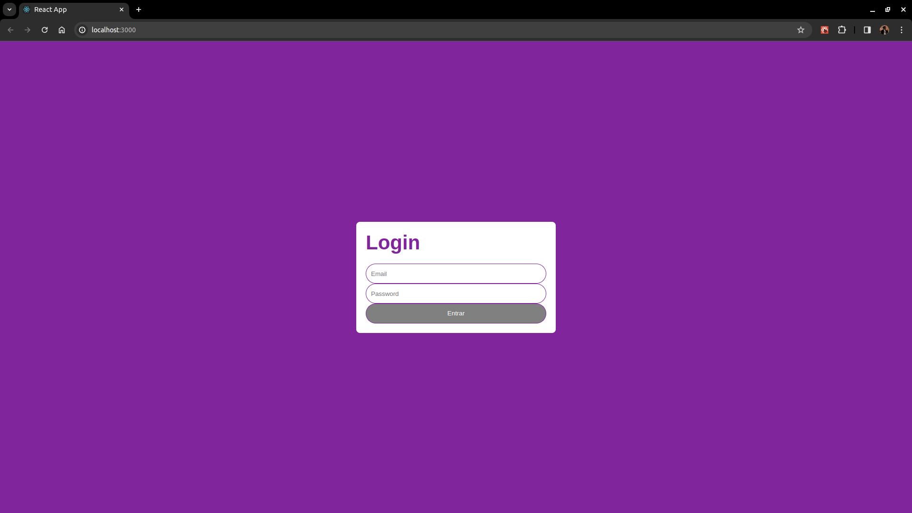
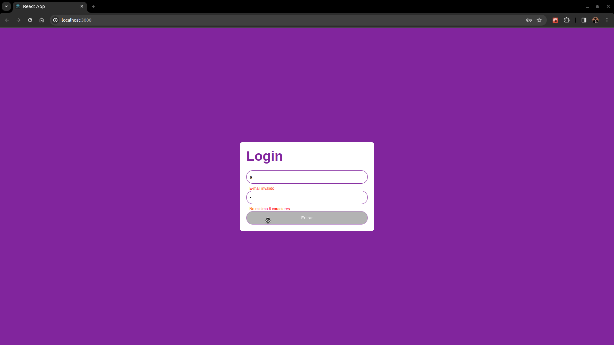
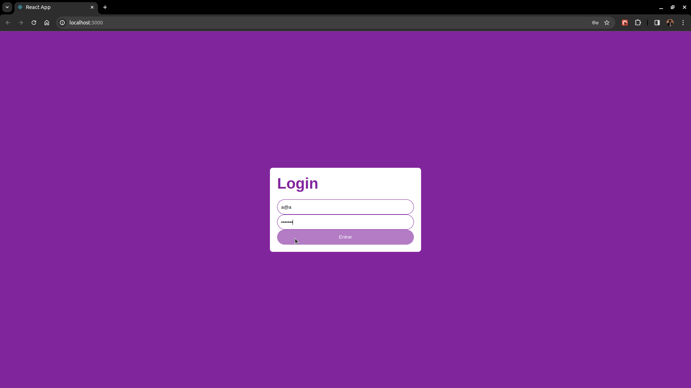

# Projeto: Tela de login com validação

Este projeto foi desenvolvido como parte do curso **Implementando Uma Tela de Login Com Validação Usando TypeScript - Digital Innovation One**.





## Descrição
O objetivo do projeto é fazer a validação de campos em um form utilizando React e TypeScript

## Funcionalidades
- Validar os campos:
  - Email
  - Senha
- Caso algum campo do formulários for inválido desabilita o botão 'Entrar' e exibe de forma visual para ao usuário.

## Como usar

1. Clone o repositório para o seu ambiente local:

   ```bash
   git clone https://github.com/FavaroDarkStar/tela-login-validacao-ts.git
   ``` 
 
2. Acesse o diretório do projeto:

   ```bash
   cd tela-login-validacao-ts
   ```

3. Instale as dependências necessárias:

   ```bash
   npm install
   ```

4. Execute o aplicativo:

   ```bash
   npm start
   ```
